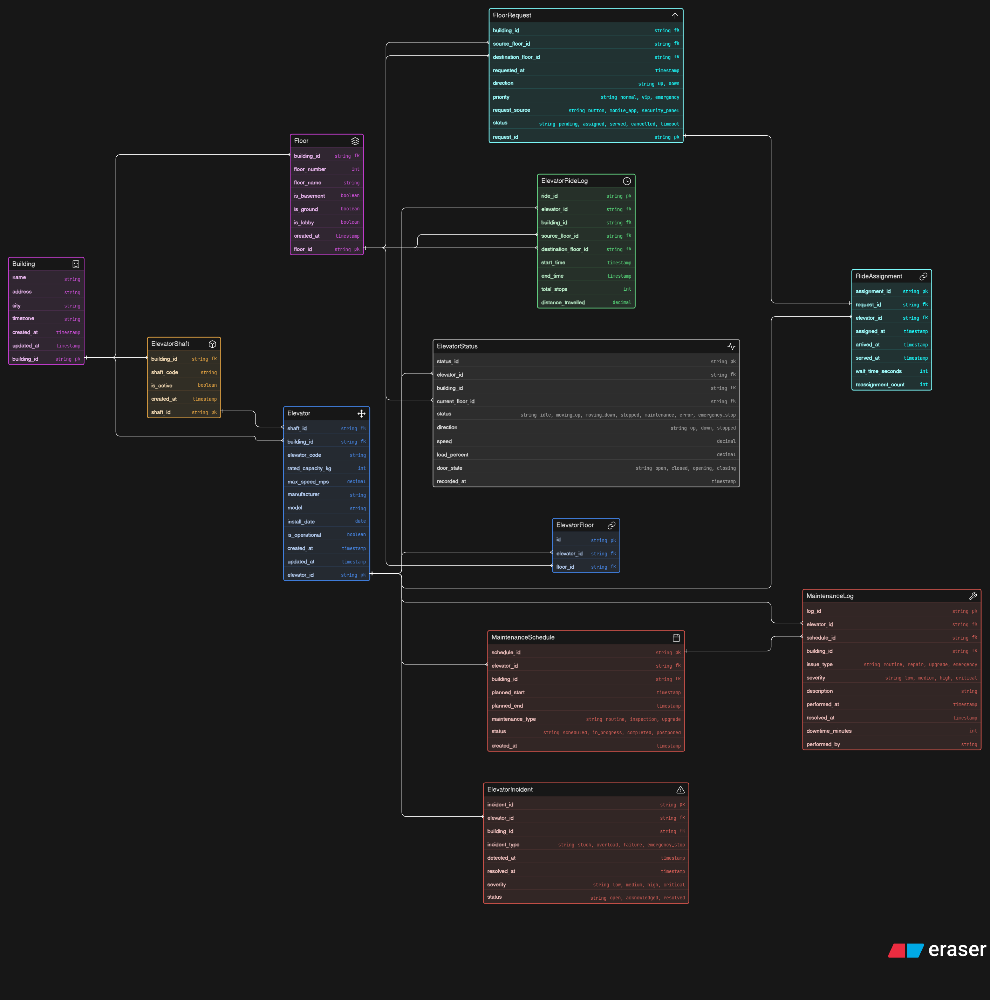

# 🏢 LiftGrid – Smart Elevator Control System (ER Diagram)

---

## 📌 Overview  

This project is a database design for a smart elevator control system used in large buildings like offices, malls, or airports.

Instead of a simple “lift goes up/down” model, this tries to capture how things actually work at scale:
- multiple elevators in one building  
- continuous floor requests  
- dynamic assignment of elevators  
- real-time status tracking  
- maintenance and failure handling  

---

## 🎯 What I Tried to Solve  

When I started, the main confusion was:
- where should requests live?  
- should assignment be inside elevator or separate?  
- how to track real-time vs history?  

---

## 🧠 Design Thinking  

I broke the system into layers:

- **Structure** → buildings, floors, elevators  
- **Mapping** → which elevator serves which floors  
- **Flow** → request → assignment → ride  
- **Tracking** → live status vs historical logs  
- **Operations** → maintenance and incidents  

Big decisions:
- kept `FloorRequest` and `RideAssignment` separate (helps in reassignments later)
- added `ElevatorFloor` for proper many-to-many mapping  
- separated `ElevatorStatus` (real-time) from `ElevatorRideLog` (history)  
- didn’t overload the `Elevator` table with dynamic data  

---

## 🗂️ Main Entities  

**Structure**
- Building  
- Floor  

**Elevator Setup**
- ElevatorShaft  
- Elevator  
- ElevatorFloor  

**Request Flow**
- FloorRequest  
- RideAssignment  

**Execution**
- ElevatorRideLog  

**Monitoring**
- ElevatorStatus  

**Operations**
- MaintenanceSchedule  
- MaintenanceLog  
- ElevatorIncident  

---

## 🔗 Core Relationships  

| Entity A      | Entity B            | Type | Notes |
|--------------|--------------------|------|------|
| Building     | Floor              | 1:N  | One building has many floors |
| Building     | Elevator           | 1:N  | Multiple elevators per building |
| Elevator     | Floor              | M:N  | Via `ElevatorFloor` |
| Floor        | FloorRequest       | 1:N  | Requests originate from floors |
| FloorRequest | RideAssignment     | 1:1  | Each request gets assigned |
| Elevator     | RideAssignment     | 1:N  | One elevator handles many requests |
| Elevator     | ElevatorRideLog    | 1:N  | Ride history |
| Elevator     | ElevatorStatus     | 1:N  | Real-time updates |
| Elevator     | MaintenanceSchedule| 1:N  | Planned maintenance |
| Elevator     | MaintenanceLog     | 1:N  | Completed work |
| Elevator     | ElevatorIncident   | 1:N  | Failures / issues |

---

## 🔄 Flow (How things actually move)

```text
User presses button / triggers request
        ↓
FloorRequest created
        ↓
System assigns best elevator
        ↓
RideAssignment created
        ↓
Elevator completes trip
        ↓
Stored in ElevatorRideLog
        ↓
Live updates via ElevatorStatus
```
---

## 🖼️ ER Diagram  



---

## 🏁 Final Thoughts  

This started as a simple ERD exercise but turned into understanding:

- why separation of concerns matters  
- how real systems handle continuous events  
- how not to mix static and dynamic data  

Still not perfect, but feels much closer to how real systems are designed.
